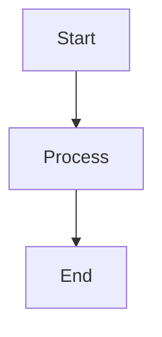

# Compose

Minimal, dependency-free Markdown typesetting system.

## Installation

```bash
poetry install
```

## Usage

### Basic Usage

Using the `compose` executable:
```bash
poetry run compose build notes.md --config compose.toml
```

Or as a Python module:
```bash
poetry run python -m compose.cli build notes.md --config compose.toml
```

### Development Workflow

#### Watch Mode
Automatically rebuild when files change:
```bash
poetry run compose watch notes.md --config compose.toml
```

#### Linting
Check your markdown files for issues:
```bash
poetry run compose lint notes.md
```

### TOML Frontmatter

Add metadata to your markdown files using TOML syntax:

```markdown
+++
title = "My Document"
description = "Document description"
author = "Author Name"
date = "2025-11-07"
mode = "document"
+++

# Document Content
```

Frontmatter metadata is automatically included in HTML output and can override configuration settings.

### Output Formats

Compose supports multiple output formats:

- **Text**: Clean, readable markdown-like output (default)
- **HTML**: Styled web pages with syntax highlighting
- **PDF**: Minimal PDF generation using raw PDF format

### Modes

- **Document Mode** (default): Traditional document layout
- **Slides Mode**: Presentation slides (H1 headings become slide breaks)

## Configuration

Example `compose.toml`:
```toml
mode = "document"  # or "slides"
output = "pdf"     # "text", "html", or "pdf"
```

## Features

### Phase 1 (Complete) 

- Markdown parsing (headings, paragraphs, lists, horizontal rules)
- **Bold/italic text formatting** (`**bold**`, `*italic*`, `***both***`)
- **Inline code** (`` `code` ``)
- **Code blocks** with language detection
- **Tables** (GitHub-flavored Markdown)
- **Math syntax** (`$inline$` and `$$block$$`)
- **Image embedding** (``)
- Multiple output formats (text, HTML, PDF)
- Slides mode for presentations
- TOML configuration
- Poetry packaging with executable
- **Markdown linting** (`compose lint`)
- Zero external dependencies

### Phase 2 (Advanced Features) 

- **Strikethrough text** (`~~strikethrough~~`)
- **Links** (`[text](url)`)
- **Blockquotes** (`> text`)
- **Task lists** (`- [x] completed`, `- [ ] pending`)
- **Smart typography** (quotes, dashes, ellipses)
- **Enhanced linting** (heading hierarchy, table validation, link checking)
- **Basic syntax highlighting** (Python, JavaScript in HTML output)

### Phase 3 (Advanced Features) 

- **Typography configuration** (fonts, sizes, spacing, colors)
- **Mermaid diagrams** (ASCII art rendering)
- **Enhanced output formats** (JSON AST, plain text)
- **Advanced configuration system** (deep merge, defaults)
- **Customizable styling** (HTML with dynamic CSS)
- **Professional document controls** (margins, scaling)

### Markdown Support

- Headings (# ## ###)
- Paragraphs with **smart typography**
- Lists (- item, * item, **task lists**)
- **Bold/italic formatting** (**bold**, *italic*, ***both***)
- **Strikethrough** (~~text~~)
- **Inline code** (`code`)
- **Links** ([text](url))
- **Task lists** (- [x] item, - [ ] item)
- **Blockquotes** (> text)
- Code blocks (```language) with **syntax highlighting**
- Tables (| col1 | col2 |)
- **Math expressions** ($inline$, $$block$$)
- **Images** ()
- **Mermaid diagrams** (```mermaid)
- **Smart typography** ("quotes", --dashes, ...ellipses)
- Horizontal rules (---)

## Advanced Features

### Mermaid Diagrams

Render simple flowcharts as ASCII art:



### Task Lists

Interactive checkboxes for project management:

- [x] Completed task
- [ ] Pending task
- [x] Another completed item

### Enhanced Linting

Comprehensive markdown validation:

```bash
compose lint document.md
```

Checks for:
- Heading hierarchy violations
- Trailing whitespace
- Table formatting issues
- Broken links and images
- Code block validation

## Examples

See `advanced-features.md` for comprehensive demonstrations of all capabilities.

See `test.md` and `slides.md` for comprehensive examples of all supported features.
