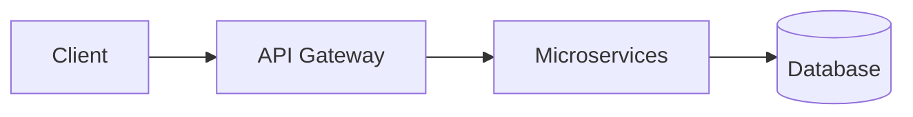

# Compose User Guide: Advanced Features

This guide demonstrates the advanced features of Compose, showing how to create professional documents with mathematical typesetting, cross-references, bibliography management, and more.

## 📚 Table of Contents

1. [Mathematical Typesetting](#mathematical-typesetting)
2. [Macro System](#macro-system)
3. [Cross-References](#cross-references)
4. [Bibliography](#bibliography)
5. [Diagrams and Visualizations](#diagrams-and-visualizations)
6. [Slide Presentations](#slide-presentations)
7. [Typography and Micro-typography](#typography-and-micro-typography)
8. [Linting and Validation](#linting-and-validation)
9. [Plugin System](#plugin-system)
10. [Configuration](#configuration)

## 📐 Mathematical Typesetting

Compose provides LaTeX-quality mathematical typesetting with advanced layout algorithms.

### Basic Math Expressions

```markdown
Inline math: $E = mc^2$

Display math:
$$\int_{-\infty}^{\infty} e^{-x^2} dx = \sqrt{\pi}$$

Fractions: $\frac{a + b}{c - d}$

Superscripts and subscripts: $x^{2} + y_{i}$
```

### Advanced Math Features

#### Matrices
```markdown
$$\begin{pmatrix}
a & b & c \\
d & e & f \\
g & h & i
\end{pmatrix}$$

$$\begin{bmatrix}
1 & 0 \\
0 & 1
\end{bmatrix}$$
```

#### Large Operators
```markdown
Sums: $$\sum_{i=1}^{n} x_i$$

Products: $$\prod_{k=1}^{m} a_k$$

Integrals: $$\int_{0}^{\infty} f(x) \, dx$$

Limits: $$\lim_{x \to 0} \frac{\sin x}{x} = 1$$
```

#### Radicals
```markdown
Square roots: $$\sqrt{x^2 + y^2}$$

Higher roots: $$\sqrt[3]{x^3 + y^3}$$
```

#### Delimiters
```markdown
Parentheses: $$\left( \frac{a}{b} \right)$$

Brackets: $$\left[ \sum_{i} x_i \right]$$

Braces: $$\left\{ x \mid x > 0 \right\}$$
```

## 🔧 Macro System

Define reusable macros for complex expressions and abbreviations.

### Basic Macros

```markdown
\newcommand{\R}{\mathbb{R}}
\newcommand{\N}{\mathbb{N}}
\newcommand{\Z}{\mathbb{Z}}

Let $f: \R \to \R$ be a continuous function.
```

### Parameterized Macros

```markdown
\newcommand{\vector}[1]{\mathbf{#1}}
\newcommand{\norm}[1]{\left\| #1 \right\|}
\newcommand{\inner}[2]{\langle #1, #2 \rangle}

Given vectors $\vector{u}, \vector{v} \in \R^n$:
$$\norm{\vector{u} + \vector{v}}^2 = \norm{\vector{u}}^2 + 2\inner{\vector{u}}{\vector{v}} + \norm{\vector{v}}^2$$
```

### Advanced Macro Usage

```markdown
% Define theorem environment
\newcommand{\theorem}[1]{\textbf{Theorem.} #1}
\newcommand{\proof}{\textbf{Proof.}}

\theorem{If $f$ is differentiable and $f'(x) = 0$ for all $x$, then $f$ is constant.}

\proof{Let $a < b$. By the Mean Value Theorem, there exists $c \in (a,b)$ such that $f(b) - f(a) = f'(c)(b - a) = 0$. Thus $f(a) = f(b)$.}
```

## 🔗 Cross-References

Automatic numbering and referencing for figures, tables, equations, and sections.

### Figure References

```markdown
See Figure \ref{fig:neural-net} for the network architecture.

{#fig:neural-net}
```

### Table References

```markdown
The results are summarized in Table \ref{tab:results}.

| Method | Accuracy | F1-Score |
|--------|----------|----------|
| Baseline | 0.85 | 0.83 |
| Ours | 0.92 | 0.91 |

{#tab:results}
```

### Equation References

```markdown
Using the identity from Equation \ref{eq:pythagoras}:

$$a^2 + b^2 = c^2$${#eq:pythagoras}

We can derive the distance formula.
```

### Section References

```markdown
See Section \ref{sec:methodology} for details.

## Methodology {#sec:methodology}

Our approach consists of three main steps...
```

## 📚 Bibliography

Comprehensive citation management with multiple styles.

### Adding Sources

```markdown
@article{smith2023,
  title={Deep Learning for Natural Language Processing},
  author={John Smith and Jane Doe},
  journal={Journal of AI Research},
  year={2023},
  volume={45},
  pages={123--145}
}

@inproceedings{jones2023,
  title={Attention is All You Need},
  author={Mike Jones and Sarah Wilson},
  booktitle={Proceedings of NeurIPS},
  year={2023},
  pages={5998--6008}
}

@book{brown2022,
  title={Machine Learning: A Comprehensive Guide},
  author={David Brown},
  publisher={Academic Press},
  year={2022},
  isbn={978-0123456789}
}
```

### Citations

```markdown
Recent advances in transformer architectures @vaswani2017attention
have revolutionized NLP @smith2023.

According to @brown2022 [p. 45], ensemble methods provide
significant improvements over single models.

Multiple citations: @smith2023; @jones2023; @brown2022
```

### Bibliography Output

The bibliography is automatically generated and formatted according to your chosen citation style (APA, MLA, Chicago, IEEE).

## 📊 Diagrams and Visualizations

### Flowcharts


### Sequence Diagrams


### Gantt Charts


### Network Diagrams


## 🎭 Slide Presentations

Create interactive presentations with advanced animations.

### Basic Slides

```markdown
# My Presentation

## Introduction

- Point 1
- Point 2
- Point 3

## Technical Details

### Architecture



## Conclusion

Thank you for your attention!
```

### Advanced Slide Features

#### Animation Control

Slides automatically include fade-in animations and sequential reveals for bullet points.

#### Comparison Slides

```markdown
## Before vs After

### Before
- Manual process
- Error-prone
- Time-consuming

### After
- Automated workflow
- Quality assurance
- 10x faster
```

## 🎨 Typography and Micro-typography

### Font Configuration

```toml
[typography]
font_family = "Times New Roman"
font_size = 11
line_height = 1.4

[math]
font_family = "STIX"
scale_factor = 1.1
```

### Micro-typography Features

Compose automatically applies:
- **Character protrusion**: Quotes and punctuation hang outside margins
- **Font expansion**: Optimal spacing for justified text
- **Optical alignment**: Professional text alignment

## 🔍 Linting and Validation

### Running the Linter

```bash
# Lint a single file
compose lint document.md

# Lint with custom config
compose lint document.md --config .compose-lint.toml

# Lint a directory
compose lint docs/
```

### Configuration

```toml
[general]
ignore = "MD003,MD008"  # Ignore specific rules

[rules]
MD001.max_length = 100  # Custom line length
MD005.style = "atx"     # Heading style preference
```

### Available Rules

- **MD001**: Line length limits
- **MD002**: Trailing whitespace
- **MD003**: Hard tab usage
- **MD004**: Multiple consecutive blank lines
- **MD005**: Heading style consistency
- **MD006**: Heading level hierarchy
- **MD007**: Missing alt text in images
- **MD008**: Code block style consistency

## 🔌 Plugin System

Extend Compose with custom content types.

### Creating a Plugin

```python
from compose.plugin_system import ContentPlugin
from compose.layout.universal_box import UniversalBox, ContentType

class CustomChartPlugin(ContentPlugin):
    @property
    def name(self) -> str:
        return "custom_chart"

    @property
    def version(self) -> str:
        return "1.0.0"

    @property
    def content_type(self) -> str:
        return "custom_chart"

    def can_handle(self, content: str, metadata=None) -> bool:
        return content.startswith("custom-chart:")

    def parse_to_box(self, content: str, metadata=None) -> UniversalBox:
        # Parse custom chart syntax
        chart_data = self._parse_chart_data(content[13:])  # Remove "custom-chart:" prefix

        return UniversalBox(
            content=chart_data,
            content_type=ContentType.DIAGRAM,
            attributes={"chart_type": "custom", "source": content}
        )

    def _parse_chart_data(self, data: str) -> dict:
        # Custom parsing logic
        return {"type": "custom_chart", "data": data}
```

### Using Plugins

```markdown
# Custom Chart Example

```custom-chart
title: Sales Data
data: [100, 200, 150, 300, 250]
```
```

## 📋 Configuration

### Global Configuration

```toml
[output]
format = "pdf"
quality = "high"

[math]
engine = "advanced"
dpi = 600

[typography]
font_family = "Times New Roman"
font_size = 11
line_height = 1.4

[features]
macros = true
cross_references = true
bibliography = true
microtypography = true
animations = true

[bibliography]
style = "apa"
sort_by = "author"

[linting]
max_line_length = 100
heading_style = "atx"
```

### Frontmatter Overrides

```markdown
+++
title = "Advanced Compose Features"
author = "Compose Team"
date = "2025-01-07"
bibliography = "refs.bib"
+++

# Document Content

This document demonstrates advanced features...
```

## 🚀 Advanced Workflows

### Batch Processing

```bash
# Process multiple files
for file in docs/*.md; do
    compose build "$file" --config config.toml
done
```

### CI/CD Integration

```yaml
# .github/workflows/docs.yml
name: Build Documentation
on: [push, pull_request]

jobs:
  build:
    runs-on: ubuntu-latest
    steps:
    - uses: actions/checkout@v2
    - uses: actions/setup-python@v2
      with:
        python-version: '3.12'
    - name: Install Compose
      run: pip install git+https://github.com/compose/compose.git
    - name: Lint documents
      run: compose lint docs/
    - name: Build documentation
      run: compose build docs/index.md --config docs.toml
    - name: Deploy
      run: # Deploy built documentation
```

### Custom Build Scripts

```python
#!/usr/bin/env python3
import os
from compose.engine import build

def build_site():
    """Build complete documentation site"""
    config = {
        "output": "html",
        "multi_page": True,
        "features": {
            "macros": True,
            "cross_references": True,
            "bibliography": True
        }
    }

    # Build main documentation
    for root, dirs, files in os.walk("docs"):
        for file in files:
            if file.endswith(".md"):
                md_path = os.path.join(root, file)
                build(md_path, "config.toml")

if __name__ == "__main__":
    build_site()
```

---

This guide covers the most advanced features of Compose. For more details, see the API documentation and example files in the repository.
