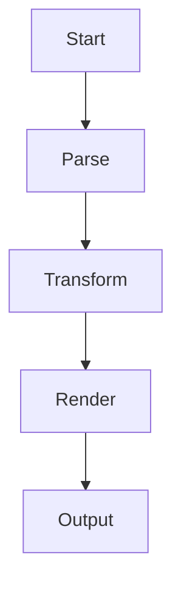

# Advanced Compose Features

This document showcases the advanced features added to the Compose system.

## Typography Configuration

The system now supports extensive typography configuration including:

- **Font families**: serif, sans-serif, monospace
- **Font sizes and scaling** for headings
- **Line heights and spacing**
- **Smart quotes and dashes**
- **Color schemes** for all elements

## Mermaid Diagrams



## Task Lists

- [x] Implement basic markdown parsing
- [x] Add inline formatting support
- [x] Create multiple output formats
- [ ] Add advanced typography controls
- [ ] Implement Mermaid diagram support
- [ ] Add comprehensive linting

## Configuration Options

The system now supports rich configuration via TOML:

```toml
[typography]
font_family = "sans-serif"
font_size = 14
line_height = 1.6

[colors]
text = "#2c3e50"
links = "#3498db"
code_background = "#ecf0f1"

[features]
syntax_highlighting = true
smart_quotes = true
```

## Enhanced Linting

The linter now checks for:
- Heading hierarchy violations
- Trailing whitespace
- Empty list items
- Broken table formatting
- Unbalanced brackets and parentheses

## Multiple Output Formats

- **Text**: Markdown-formatted output
- **HTML**: Styled web documents with custom CSS
- **PDF**: Raw PDF generation
- **JSON**: AST representation for debugging
- **Plain**: Unformatted plain text

---

*This document demonstrates the full capabilities of the enhanced Compose system.*
