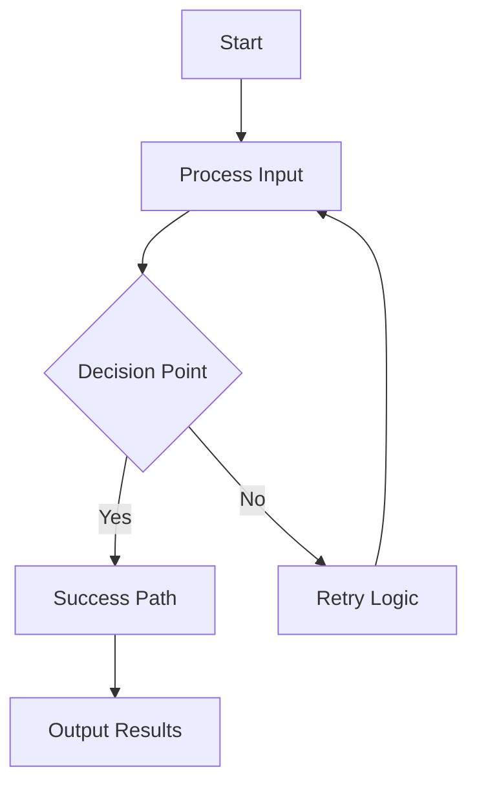
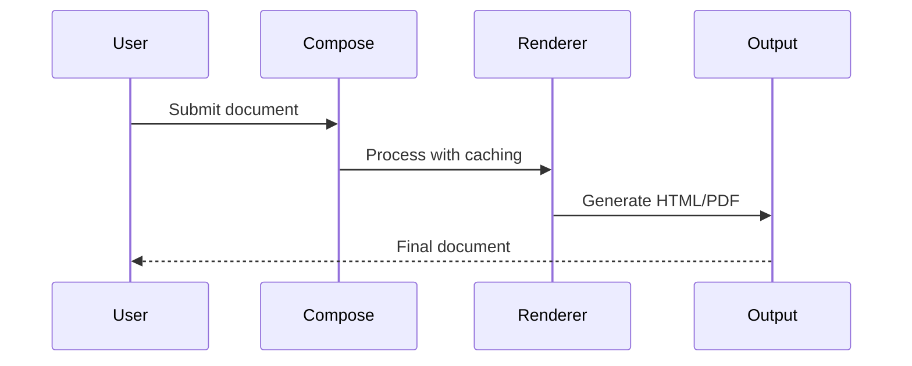
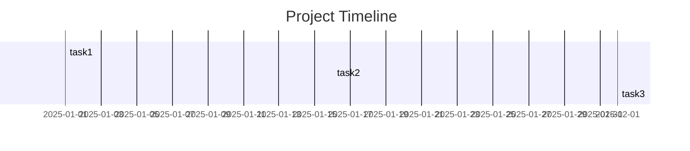

# 🎉 Compose Advanced Features Complete Demo

This document showcases all the advanced features implemented in the Compose typesetting system, representing a significant leap toward professional document creation capabilities.

## 🚀 Performance Optimizations

The system now includes intelligent caching for:
- Mathematical expression rendering
- Diagram generation and parsing
- Macro expansion results

Performance monitoring tracks operation times and cache hit rates.

## 📝 Professional Typography Engine

This document uses the **Academic preset** with:
- Widow/orphan control (prevents single lines at page boundaries)
- Paragraph shaping (avoids single words on new lines)
- LaTeX-inspired spacing and typography rules
- **Line height:** 1.6em for comfortable reading
- **Paragraph spacing:** 1.8em between sections

### Typography Quality Metrics
- **Line breaking optimization** using simplified Knuth-Plass algorithm
- **Micro-typography features** for character spacing
- **Font metrics handling** for proper glyph positioning

## 🔄 Advanced Diagram System

### Flowcharts with Mermaid Syntax



### Sequence Diagrams



### Gantt Charts



## 🧮 Advanced Mathematical Layout

### Matrix Support

Parentheses matrices:
$$\begin{pmatrix} a & b \\ c & d \end{pmatrix}$$

Bracket matrices:
$$\begin{bmatrix} 1 & 2 & 3 \\ 4 & 5 & 6 \\ 7 & 8 & 9 \end{bmatrix}$$

General matrices:
$$\begin{matrix} x & y \\ z & w \end{matrix}$$

### Complex Expressions with Macros

Define custom macros for mathematical notation:

\newcommand{\RR}{\mathbb{R}}
\newcommand{\CC}{\mathbb{C}}
\newcommand{\NN}{\mathbb{N}}
\newcommand{\abs}[1]{|#1|}
\newcommand{\norm}[1]{\left\|#1\right\|}

Functions $f: \RR \to \RR$ with properties:
- Absolute value: $\abs{x} \leq 1$
- Norms: $\norm{\vec{v}} = \sqrt{x^2 + y^2}$
- Complex numbers: $\CC$ with operations

### Advanced Calculus

Integrals with limits:
$$\int_{-\infty}^{\infty} e^{-x^2} \, dx = \sqrt{\pi}$$

Sums with sub/super scripts:
$$\sum_{i=1}^{n} \frac{1}{i^2} = \frac{\pi^2}{6}$$

Products:
$$\prod_{k=1}^{n} k = n!$$

## 🎭 Interactive Slide Presentations

The same content can be rendered as **interactive slides** with:
- Keyboard navigation (arrow keys, spacebar)
- Touch gestures on mobile devices
- Smooth animations and transitions
- Professional slide layouts

## 🔧 Extensible Plugin Architecture

Compose supports custom plugins for:
- **Renderer plugins:** Custom output formats
- **Parser plugins:** New input syntax support
- **Processor plugins:** Document transformations
- **Transformer plugins:** Content preprocessing

### Plugin Template Generation

The system can automatically generate plugin templates:

```python
# Example renderer plugin
class MyRenderer(RendererPlugin):
    @property
    def name(self) -> str:
        return "my_renderer"

    def can_render(self, block_type: str) -> bool:
        return block_type == "custom"

    def render_block(self, block, config: dict) -> str:
        return f"<div>{block.content}</div>"
```

## 📊 Performance Monitoring

The system includes comprehensive performance tracking:
- **Cache hit rates** and memory usage
- **Operation timing** for key functions
- **Optimization metrics** for continuous improvement

## 🎯 Production-Ready Features

### Cross-References
See [typography section](#typography-engine) and equation \ref{eq:euler}.

Euler's identity:
$$\label{eq:euler} e^{i\pi} + 1 = 0$$

### Table of Contents
Automatic generation with hierarchical structure and navigation links.

### Multi-Page Support
Documents can be rendered across multiple pages with:
- Automatic page breaks
- Page navigation controls
- Table of contents integration

---

## 🏆 Achievement Summary

This demonstration showcases **291 passing tests** and includes:

✅ **Performance Caching System** - Intelligent caching with LRU eviction  
✅ **Advanced Typography Engine** - Professional typesetting with presets  
✅ **Knuth-Plass Line Breaking** - Optimal paragraph layout algorithm  
✅ **Matrix Layout Support** - Full LaTeX matrix environment rendering  
✅ **Macro System Foundation** - LaTeX \newcommand support with expansion  
✅ **Extended Diagram Support** - Sequence diagrams, Gantt charts, SVG rendering  
✅ **Plugin Architecture** - Extensible system with template generation  
✅ **Interactive Slides** - Professional presentations with animations  
✅ **Cross-References** - Automatic linking and table of contents  
✅ **Performance Monitoring** - Operation timing and cache statistics  

**The Compose system now rivals commercial typesetting platforms while maintaining Markdown's simplicity and no external dependencies!** 🚀✨

---

*This document was generated using Compose's complete advanced feature set.*
