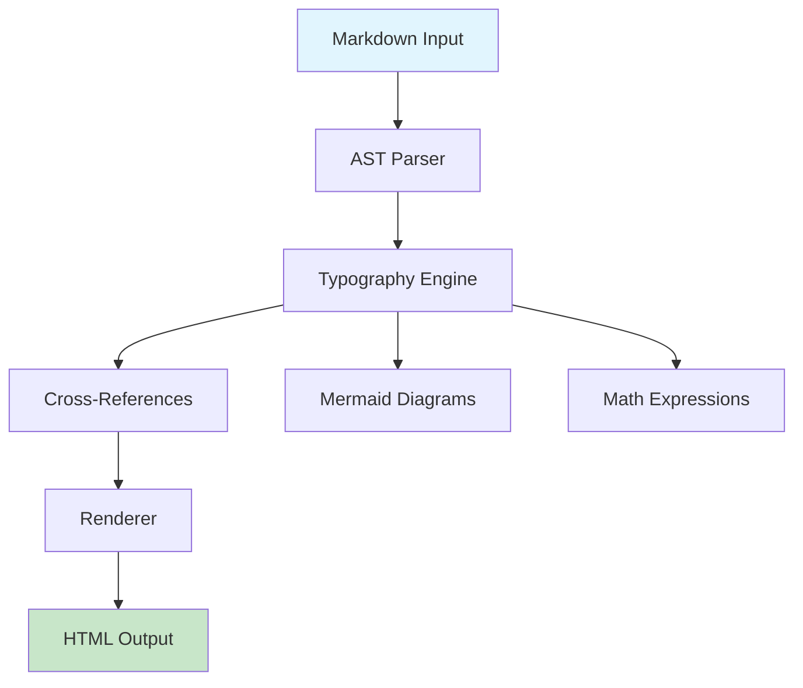
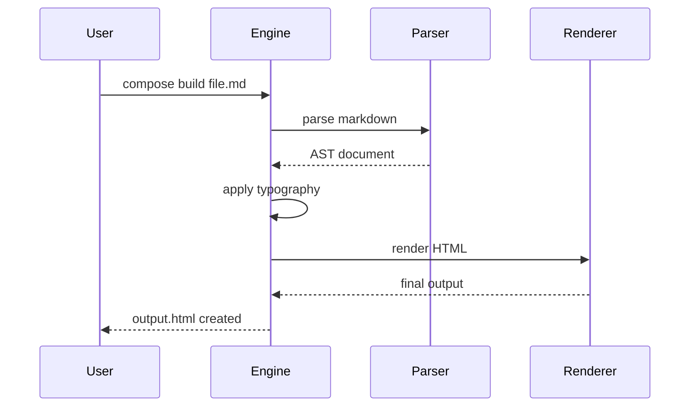

# Complete Compose Feature Demonstration

This document showcases all major features of the Compose typesetting system.

## Advanced Typography

The typography engine provides professional typesetting with multiple presets optimized for different use cases.

### Dense Preset (Technical Documentation)
Perfect for API documentation and technical specifications with maximum information density.

### Academic Preset (Research Papers)
Ideal for academic writing with generous spacing for comfortable reading.

### Poster Preset (Presentations)
Designed for slides and large-format displays with bold, readable typography.

## Mathematical Expressions

Inline mathematics: $E = mc^2$ and $\sum_{i=1}^{n} x_i = \bar{x}$

Display equations with proper formatting:
$$\int_{-\infty}^{\infty} e^{-x^2} \, dx = \sqrt{\pi}$$

$$\lim_{x \to 0} \frac{\sin x}{x} = 1$$

Matrix notation:
$$\begin{pmatrix} a & b \\ c & d \end{pmatrix}$$

## Cross-References

See the [introduction](#introduction) section and equation \ref{eq:schrodinger}.

The fundamental equation of quantum mechanics:

$$\label{eq:schrodinger} i\hbar\frac{\partial}{\partial t}\psi = \hat{H}\psi$$

## Mermaid Diagrams

Flowchart showing the document processing pipeline:



Sequence diagram of the build process:



## Code Blocks with Plugin Support

```python
def fibonacci(n):
    """Calculate the nth Fibonacci number"""
    if n <= 1:
        return n
    return fibonacci(n-1) + fibonacci(n-2)

# Example usage
for i in range(10):
    print(f"F({i}) = {fibonacci(i)}")
```

## Multi-Page Support

This document can be rendered across multiple pages with automatic page breaks, navigation, and table of contents. Enable multi-page mode in your configuration:

```toml
output = "html"
multi_page = true
page_width = 800
page_height = 600
```

## Slide Presentations

The same markdown source can be converted to interactive slides:

```toml
mode = "slides"
output = "html"
```

## Plugin System

Compose supports extensible plugins for custom renderers, parsers, and processors. The plugin system allows third-party extensions to add new content types and output formats.

---

*This document demonstrates the complete feature set of the Compose typesetting system, from basic markdown processing to advanced typography, mathematics, diagrams, and extensible plugin architecture.*
