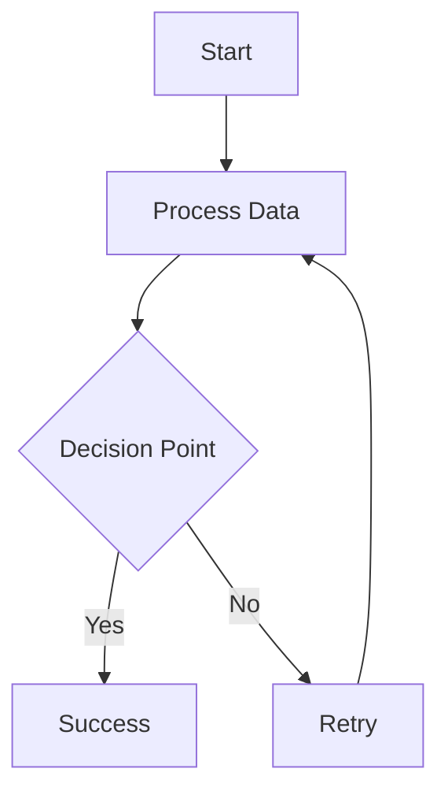

# Compose Advanced Features

This document demonstrates the new advanced features in Compose.

## Mermaid Diagrams

## Mathematical Expressions

Inline math: $E = mc^2$

Display math:
$$\int_{-\infty}^{\infty} e^{-x^2} \, dx = \sqrt{\pi}$$

## Cross-References

See the [introduction](#introduction) section for more details.

This equation \ref{eq:pythagoras} is fundamental:

$$\label{eq:pythagoras} a^2 + b^2 = c^2$$

## Multi-Page Support

This document can be rendered as multiple pages with automatic page breaks and navigation.

## Slide Mode

Set `mode: slides` in config to create interactive presentations from the same markdown.
