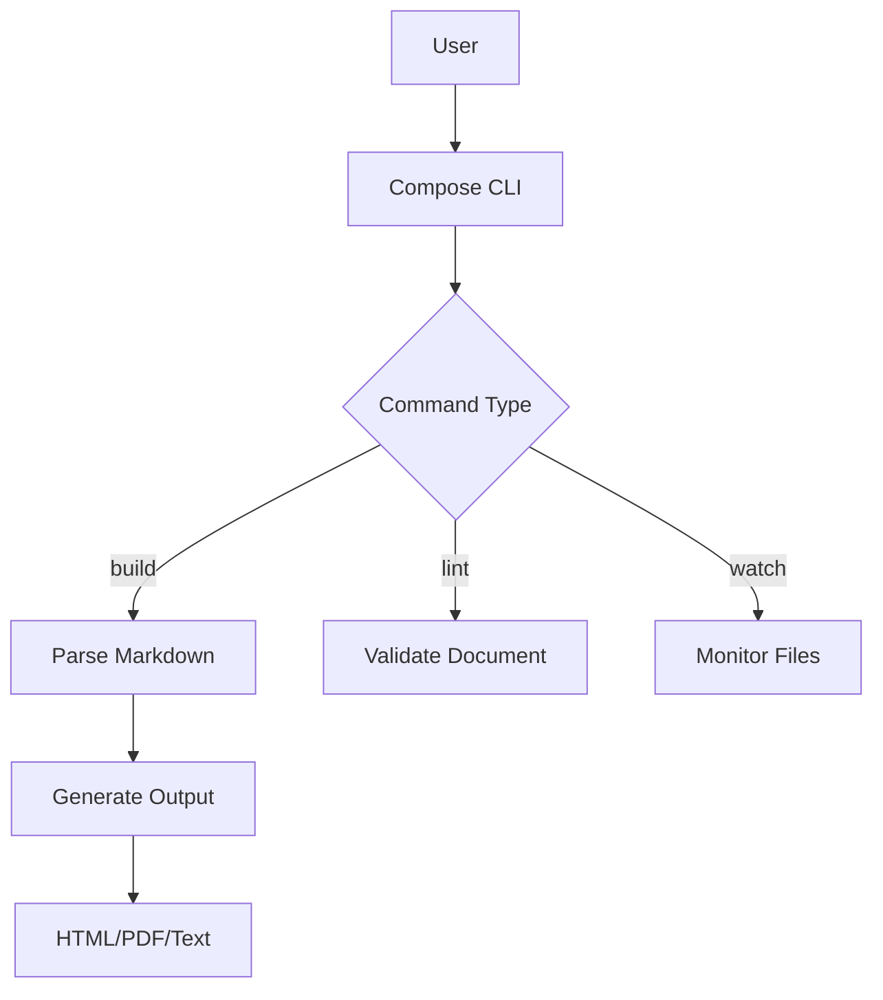

+++
title = "Compose: Advanced Features Showcase"
description = "A comprehensive demonstration of all advanced features in the Compose markdown typesetting system"
author = "Compose Development Team"
date = "2025-11-07"
mode = "document"
+++

# Compose: Advanced Features Showcase

This document demonstrates the advanced features of the Compose system, including TOML frontmatter, enhanced markdown support, and professional output.

## TOML Frontmatter Support

This document includes TOML frontmatter at the top with metadata:

- **Title**: Automatically used in HTML `<title>` and Open Graph tags
- **Description**: Used for meta description and social sharing
- **Author**: Included in HTML meta tags
- **Date**: Document publication date
- **Mode**: Document rendering mode

## Enhanced Markdown Features

### Typography with Smart Quotes

Compose includes smart typography: "Hello world" and 'single quotes' are automatically converted to proper typographer's quotes.

### Advanced Lists

- [x] **Bold task** - Completed item with formatting
- [ ] *Italic task* - Pending item with emphasis
- [x] Regular completed task
- [ ] Task with `inline code` formatting

### Mermaid Diagrams



## Mathematical Expressions

### Inline Math
Einstein's famous equation: $E = mc^2$

### Block Math
Complex mathematical expressions:

$$
\int_{-\infty}^{\infty} e^{-x^2} dx = \sqrt{\pi}
$$

## Code with Syntax Highlighting

### Python Example
```python
def compose_pipeline(content: str, config: dict) -> str:
    """
    Complete document processing pipeline.

    Args:
        content: Markdown source text
        config: Configuration dictionary

    Returns:
        Rendered output string
    """
    # Parse with frontmatter support
    nodes, metadata = parse_markdown(content)

    # Apply configuration
    output_format = config.get('output', 'html')

    # Render with custom styling
    if output_format == 'html':
        return render_html(nodes, config)
    else:
        return render_text(nodes, config)
```

### JavaScript with Advanced Features
```javascript
class ComposeRenderer {
    constructor(config = {}) {
        this.config = {
            syntaxHighlight: true,
            mathSupport: true,
            ...config
        };
    }

    render(nodes) {
        return nodes.map(node => {
            switch(node.type) {
                case 'heading':
                    return `<h${node.level}>${node.text}</h${node.level}>`;
                case 'code_block':
                    return this.renderCodeBlock(node);
                default:
                    return `<p>${node.text}</p>`;
            }
        }).join('\n');
    }

    renderCodeBlock(node) {
        const lang = node.language || '';
        return `<pre><code class="language-${lang}">${node.text}</code></pre>`;
    }
}
```

## Professional Output Features

### Custom Styling Configuration

The system supports extensive configuration:

```toml
[typography]
font_family = "sans-serif"
font_size = 14
line_height = 1.6

[colors]
text = "#2c3e50"
headings = "#1a252f"
links = "#3498db"
```

### HTML Metadata Integration

Documents with frontmatter automatically include:
- Proper `<title>` tags
- Meta descriptions
- Open Graph tags for social sharing
- Author and date information

## Development Workflow

### Watch Mode

Use `compose watch file.md --config config.toml` for automatic rebuilding during development.

### Linting

Comprehensive validation with `compose lint file.md`:
- Heading hierarchy checking
- Table format validation
- Link and image verification
- Code block language specification

---

*This showcase demonstrates the complete feature set of the Compose system, from basic markdown processing to enterprise-grade document generation with professional typography and extensive customization options.*
