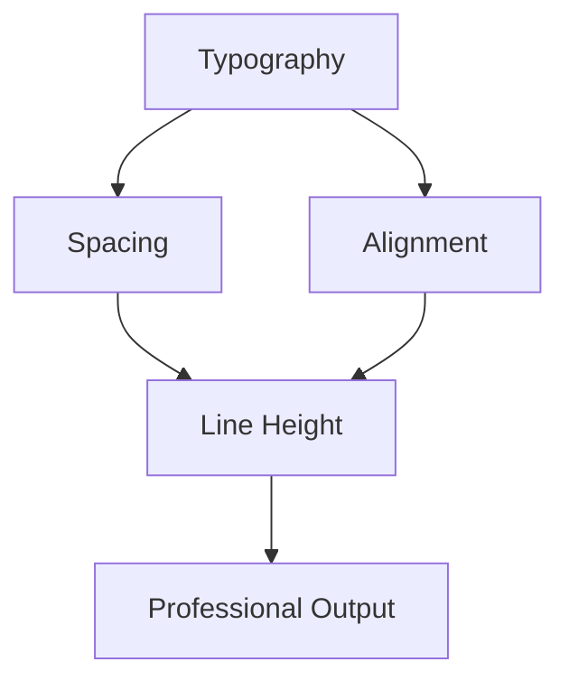

# Typography Presets

This document demonstrates the advanced typography engine with different presets.

## Dense Typography (Academic Papers)

The dense preset is perfect for academic papers and technical documentation. It uses tighter line spacing and minimal paragraph spacing to maximize information density.

### Features:
- Compact line height (1.2em)
- Minimal paragraph spacing (1.0em)
- Optimized for reading dense technical content

## Academic Typography (Research Papers)

The academic preset provides generous spacing for comfortable reading of complex research content.

### Benefits:
- Generous line height (1.6em)
- Ample paragraph spacing (1.8em)
- Professional appearance suitable for publications

## Poster Typography (Presentations)

The poster preset uses large, bold typography perfect for slides and posters.

### Use Cases:
- Presentation slides
- Conference posters
- Marketing materials
- Large format displays

# Mathematics with Typography

Inline math: $E = mc^2$

Display math with proper spacing:
$$\int_{-\infty}^{\infty} e^{-x^2} \, dx = \sqrt{\pi}$$

The typography engine ensures proper spacing and alignment of mathematical expressions.

# Mermaid Diagrams

