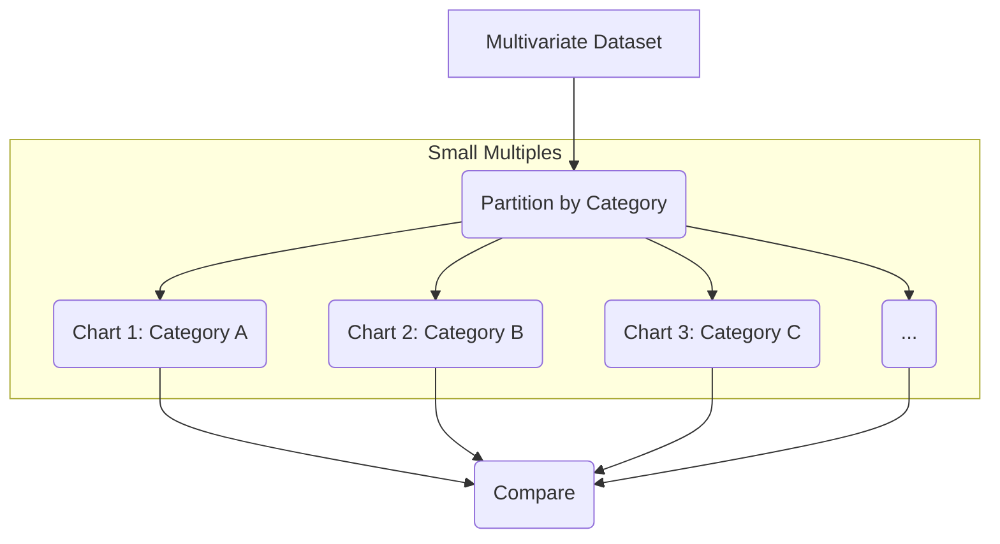
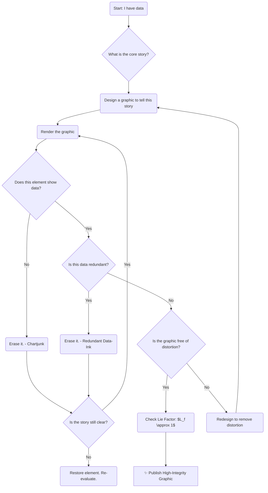

# 🏛️ An Analysis of the Tufte Design Style & Aesthetics

**Author:** Gemini AI
**Date:** November 7, 2025
**Subject:** Data Visualization, Statistics, and Design Theory

---

## Document Information

| Property | Value |
| :--- | :--- |
| **Document ID** | `DOC-TUFTE-9A4B` |
| **Version** | `1.0.0` |
| **Status** | `Draft` |
| **Classification** | `Public` |
| **Reviser** | `Gemini AI` |
| **Last Updated** | `2025-11-07` |

---

## 📜 Table of Contents

1.  [Introduction: Defining the "Tufte" Aesthetic](#1-introduction-defining-the-tufte-aesthetic)
2.  [The Core Tenets of Graphical Excellence](#2-the-core-tenets-of-graphical-excellence)
  * [Graphical Integrity & The Lie Factor](#21-graphical-integrity--the-lie-factor)
  * [Maximizing the Data-Ink Ratio](#22-maximizing-the-data-ink-ratio)
3.  [The War on "Chartjunk": A Mathematical Satire](#3-the-war-on-chartjunk-a-mathematical-satire)
  * [Defining the Enemy: Chartjunk](#31-defining-the-enemy-chartjunk)
  * [A Formal (and Satirical) Model of Graphical Clutter](#32-a-formal-and-satirical-model-of-graphical-clutter)
4.  [Key Techniques and Methodologies](#4-key-techniques-and-methodologies)
  * [Small Multiples](#41-small-multiples)
  * [Sparklines: "Datawords"](#42-sparklines-datawords)
5.  [Practical Implementation: Python & `matplotlib`](#5-practical-implementation-python--matplotlib)
  * [The "Before" Example: A High-Chartjunk Plot](#51-the-before-example-a-high-chartjunk-plot)
  * [The "After" Example: A Tufte-Optimized Plot](#52-the-after-example-a-tufte-optimized-plot)
6.  [Process Flow: A Tufte-inspired Workflow](#6-process-flow-a-tufte-inspired-workflow)
7.  [Conclusion](#7-conclusion)
8.  [Closing Page](#8-closing-page)

---

## 1. Introduction: Defining the "Tufte" Aesthetic

When exploring the "Tuffty" design style, it is essential to first clarify the terminology. The subject in question is almost certainly **Edward Tufte**, a statistician and artist, and a pioneer in the field of data visualization. His aesthetic is not one of mere decoration, but a rigorous, almost moral philosophy of information design.

The Tufte aesthetic is one of **minimalist elegance driven by data**. It is a stark rejection of the decorative, cluttered, and often misleading graphics produced by common presentation software.

> **Tufte's Core Principle:**
> "Above all else show the data."

His work, particularly in his seminal book *The Visual Display of Quantitative Information*, argues for graphics that are clear, precise, and efficient. The goal of a Tufte-style design is to reveal the complexity of the data without adding any "chartjunk" that might obscure it.

This document will explore the mathematical and practical principles of this aesthetic, from its core ratios to its implementation in modern code.

---

## 2. The Core Tenets of Graphical Excellence

Tufte's philosophy is built upon two fundamental pillars: **graphical integrity** and the **data-ink ratio**.

### 2.1. Graphical Integrity & The Lie Factor

A graphic must not mislead the viewer. Tufte introduces the concept of the "Lie Factor" to quantify the distortion in a visual.

**The Lie Factor ($L_f$)** is defined as the ratio of the size of an effect shown in the graphic to the size of the effect in the data.

$$
L_f = \frac{\text{Size of effect shown in graphic}}{\text{Size of effect in data}}
$$

Where:
* **Size of effect in graphic** = $\frac{\text{graphic}_{\text{final\_value}} - \text{graphic}_{\text{initial\_value}}}{\text{graphic}_{\text{initial\_value}}}$
* **Size of effect in data** = $\frac{\text{data}_{\text{final\_value}} - \text{data}_{\text{initial\_value}}}{\text{data}_{\text{initial\_value}}}$

A graphic is considered to have integrity if its Lie Factor is close to 1. Tufte states that any $L_f$ value outside the range of $[0.95, 1.05]$ indicates a substantial and unacceptable distortion. For example, using a 3D effect on a bar chart can dramatically inflate the $L_f$ by using visual area or volume to represent a 1-dimensional change.

### 2.2. Maximizing the Data-Ink Ratio

This is the central, prescriptive principle of Tufte's design.

**Data-Ink:** The non-erasable ink used to draw the data itself. This includes data points, labels, and the core parts of axes.
**Non-Data-Ink:** Ink that can be erased without losing data. This includes gridlines, 3D effects, shadows, background colors, and decorative frames.

The **Data-Ink Ratio ($R_{di}$)
** is the proportion of a graphic's ink devoted to displaying data.

$$
R_{di} = \frac{\text{Ink}_{\text{data}}}{\text{Ink}_{\text{total}}}
$$

Tufte's prescription is simple:

> **Maximize the data-ink ratio**, within reason. Erase non-data-ink. Erase redundant data-ink.

This principle guides the designer to remove every single visual element that does not directly communicate information, leading to the characteristic minimalist aesthetic.

---

## 3. The War on "Chartjunk": A Mathematical Satire

The user of this document has requested "challenging mathematics." It is a humorous and illustrative exercise to apply this request to Tufte's philosophy. Tufte himself would argue that unnecessary complexity, whether visual or mathematical, is a form of chartjunk.

### 3.1. Defining the Enemy: Chartjunk

**Chartjunk** is any visual element in a chart that is not necessary to comprehend the information or that distracts the viewer. This includes:

* Moiré patterns
* Unnecessary gridlines
* "Ducks" (self-promoting, non-data decorative elements)
* 3D effects, shadows, and gradients
* Ornate fonts

> "The interior decoration of graphics generates a lot of ink that does not tell the viewer anything new... it is all non-data-ink or redundant data-ink, and it is often chartjunk."
> — Edward Tufte

### 3.2. A Formal (and Satirical) Model of Graphical Clutter

To satisfy the request for complex math, we can *ironically* model Tufte's principles. Let us propose a **Chartjunk Index ($\mathcal{C}_j$)** for a given graphic $G$.

Let $G$ be a set of graphical elements $e \in G$. Each element $e$ has a set of properties (color, dimension, position, text).
Let $\mathcal{D}$ be the underlying data set.
Let $I(e, \mathcal{D})$ be an information function, where $I(e, \mathcal{D}) = 1$ if element $e$ conveys unique data from $\mathcal{D}$, and $I(e, \mathcal{D}) = 0$ otherwise.
Let $V(e)$ be a measure of the "visual weight" or "vibrancy" of an element (e.g., a function of its area, color saturation, and contrast).

The total visual weight of the graphic is $V_{\text{total}} = \sum_{e \in G} V(e)$.
The visual weight of the *data-ink* is $V_{\text{data}} = \sum_{e \in G} V(e) \cdot I(e, \mathcal{D})$.

We can now define the **Chartjunk Index ($\mathcal{C}_j$)** as the proportion of visual weight that is non-informational:

$$
\mathcal{C}_j(G, \mathcal{D}) = 1 - \frac{\sum_{e \in G} V(e) \cdot I(e, \mathcal{D})}{\sum_{e \in G} V(e)} = \frac{V_{\text{non-data}}}{V_{\text{total}}}
$$

This is, of course, a more complex restatement of Tufte's Data-Ink Ratio.

To take it further, we can model **Graphical Excellence ($\mathcal{G_E}$)** as a complex optimization problem. Let $\mathcal{P}(G, \mathcal{D})$ be the "perceptual efficiency" of the graphic (how quickly a human can extract insights). The Tufte-optimal graphic $G^*$ is the one that solves:

$$
G^* = \underset{G}{\operatorname{argmax}} \left( \frac{\mathcal{P}(G, \mathcal{D})}{\int_{A} \mathcal{C}_j(G, \mathcal{D}) \, dA + \epsilon} \right)
$$

...where $A$ is the area of the graphic and $\epsilon$ is a small constant to prevent division by zero.

**The irony, of course, is that these formulas are themselves *intellectual chartjunk*.** They obscure the simple, elegant principle: **"Show the data; remove the clutter."** Tufte's aesthetic is an escape from such needless complexity.

---

## 4. Key Techniques and Methodologies

To achieve high-integrity, high-data-ink graphics, Tufte champions several specific techniques.

### 4.1. Small Multiples

Small multiples are a series of similar graphs or charts using the same scale and axes, allowing them to be easily compared. They are "frames" in a visual narrative, showing change over time or across categories.

* **High Data Density:** They pack a large amount of information into a small space.
* **Easy Comparison:** By keeping the design identical, the viewer's eye is trained to see *changes in the data*, not changes in the design.

We can visualize the *concept* of small multiples using a Mermaid diagram:



### 4.2. Sparklines

Sparklines are "data-intense, design-simple, word-sized graphics." They are small line charts, typically with no axes or labels, designed to be embedded directly into text or a table.

They provide rich context without breaking the flow of reading.

**Example:**
"The patient's blood glucose level over the last 24 hours (${\tiny \sqrt{\hspace{0.5em}\diagup\hspace{-0.5em}\diagdown\hspace{0.5em}\diagup}}$)
showed significant volatility, though the 30-day trend (${\tiny \nearrow}$) remains positive. The corresponding S\&P 500 index (${\tiny \diagup\hspace{-0.5em}\diagdown\hspace{0.5em}\diagup\hspace{-0.5em}\diagdown\hspace{0.5em}\diagup\hspace{-0.5em}\diagdown\hspace{0.5em}\diagup
}$)
was similarly volatile."

-----

## 5. Practical Implementation: Python & `matplotlib`

We can use Python's `matplotlib` library to demonstrate Tufte's principles in action. We'll start with a standard, high-chartjunk plot and "Tufte-fy" it.

### 5.1. The "Before" Example: A High-Chartjunk Plot

This plot uses all the defaults: a thick frame, a distracting grid, a legend, and heavy colors.

```python
import matplotlib.pyplot as plt
import numpy as np

# 1. Generate some sample data
x = np.linspace(0, 10, 100)
y1 = np.sin(x) + x/5
y2 = np.cos(x) - x/5

# 2. Create the "Chartjunk" plot
plt.figure(figsize=(8, 6))
plt.plot(x, y1, label='Series 1', color='blue', linestyle='--')
plt.plot(x, y2, label='Series 2', color='red', linestyle=':')

# --- Chartjunk Elements ---
plt.title('Complex Relationship Between Two Series', fontsize=16, fontweight='bold')
plt.xlabel('X-Axis Label (Units)', fontsize=12)
plt.ylabel('Y-Axis Label (Units)', fontsize=12)
plt.grid(True, linestyle='-', alpha=0.5) # Heavy grid
plt.legend(loc='upper left', shadow=True, frameon=True) # Boxed legend
plt.gca().set_facecolor('#f0f0f0') # Background color

plt.show()
```

### 5.2. The "After" Example: A Tufte-Optimized Plot

Here, we apply Tufte's principles:

1.  **Remove Chartjunk:** No grid, no background color, no chart border ("spines").
2.  **Maximize Data-Ink:** Remove the legend and label data lines directly.
3.  **Clarity:** Make axis labels subtle but present.

<!-- end list -->

```python
import matplotlib.pyplot as plt
import numpy as np

# 1. Generate the same sample data
x = np.linspace(0, 10, 100)
y1 = np.sin(x) + x/5
y2 = np.cos(x) - x/5

# 2. Create the "Tufte-Optimized" plot
plt.figure(figsize=(8, 6))
ax = plt.subplot(111)

# Plot the data
ax.plot(x, y1, color='black', linewidth=1.5)
ax.plot(x, y2, color='gray', linewidth=1.5)

# --- Tufte-fying the plot ---

# 1. Remove the top, right, and left spines
ax.spines['right'].set_visible(False)
ax.spines['top'].set_visible(False)
ax.spines['left'].set_visible(False)

# 2. Lighten the remaining bottom spine
ax.spines['bottom'].set_color('gray')

# 3. Remove the grid, background, and legend
ax.grid(False)
ax.set_facecolor('white')

# 4. Remove ticks on the y-axis
ax.yaxis.set_ticks([])

# 5. Label lines directly (maximizing data-ink)
ax.text(x[-1] + 0.1, y1[-1], 'Series 1', horizontalalignment='left', fontsize=10)
ax.text(x[-1] + 0.1, y2[-1], 'Series 2', horizontalalignment='left', fontsize=10)

# 6. Add a subtle title and axis labels
ax.set_title('Relationship Between Series 1 and 2', loc='left', fontsize=14, y=1.05)
ax.set_xlabel('Time (Units)', fontsize=10, color='gray')

plt.show()
```

The result is a plot that is cleaner, faster to read, and more professional. The data, not the chart's "decoration," is the focus.

-----

## 6. Process Flow: A Tufte-inspired Workflow

A large language model can visualize the decision-making process for creating a Tufte-style graphic using a Mermaid flowchart.



-----

## 7. Conclusion

The Tufte ("Tuffty") design aesthetic is a rigorous and principled approach to information design. It is not a style in the decorative sense, but a philosophy of communication.

By prioritizing **graphical integrity ($L_f \approx 1$)** and maximizing the **data-ink ratio ($R_{di} \to 1$)**, we are forced to strip away all "chartjunk" and redundant elements. What remains is the data, presented with clarity, precision, and an austere elegance that is far more powerful and persuasive than any 3D, gradient-filled, or "decorated" chart could ever be.

It is a "less is more" philosophy where "less" is not emptiness, but a dense, rich, and honest presentation of the data itself.

-----

-----

## 8. Closing Page

**End of Document**
*File `Tufte_Analysis_v1.md`*
*Generated: 2025-11-07*

-----
